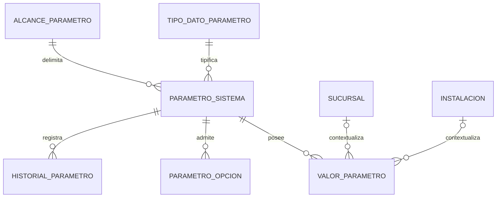

# DER Administrativo — Configuración y parametrización

## Estado

Vista documental alineada al SQL real. No representa una migración aplicada.

`parametro_sistema` es la definición canónica y `valor_parametro` la fuente canónica de valores. `parametro_opcion` sólo enumera opciones válidas de una definición: un parámetro no es un catálogo. Los contextos admitidos son `GLOBAL` (ambas FK nulas), `SUCURSAL` e `INSTALACION`, con precedencia `INSTALACION > SUCURSAL > GLOBAL`.

`configuracion_general` queda fuera del grafo canónico como compatibilidad heredada: no recibe claves ni consumidores nuevos, tendrá migración incremental y su eliminación física es futura. `configuracion_local` tampoco integra este DER: pertenece a Operativo y no participa de #425.

El SQL vigente aún no materializa toda la semántica congelada: faltan metadata de editabilidad/visibilidad/sensibilidad, CORE-EF completo de `valor_parametro`, restricción de no solapamiento y query service interno. `historial_parametro` actual referencia al parámetro y no demuestra por sí solo historial por valor y contexto. Todo ello permanece pendiente.

Para #425, el subgrafo exclusivo es `parametro_sistema -> valor_parametro` con alcance `GLOBAL`, `id_sucursal IS NULL` e `id_instalacion IS NULL`; no intervienen `configuracion_general`, `configuracion_local` ni catálogos.
