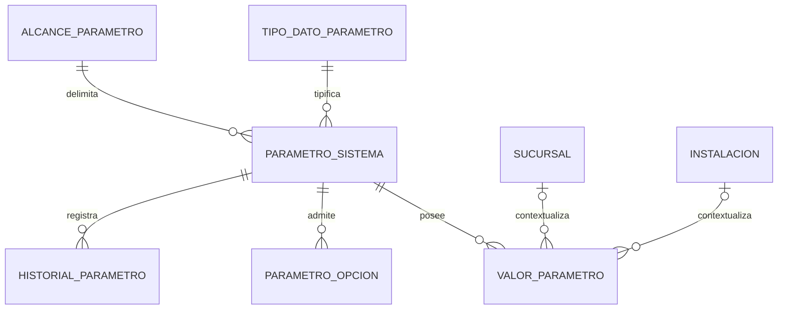

# DER Administrativo — Configuración y parametrización

## Estado

Vista documental alineada al SQL real. No representa una migración aplicada.

`parametro_sistema` es la definición canónica y `valor_parametro` la fuente canónica de valores. `parametro_opcion` sólo enumera opciones válidas de una definición: un parámetro no es un catálogo. Para #425, `GLOBAL` significa ambas FK nulas. Las columnas físicas opcionales de sucursal e instalación evidencian contextos posibles, pero el catálogo cerrado de alcances, el significado de `alcance_parametro`, los overrides, la precedencia, la exigencia de una base global y el fallback futuro permanecen **NO CONFIRMADOS**.

`configuracion_general` queda fuera del grafo canónico como compatibilidad heredada: no recibe claves ni consumidores nuevos, tendrá migración incremental y su eliminación física es futura. `configuracion_local` tampoco integra este DER: pertenece a Operativo y no participa de #425.

Desde #410, `valor_parametro` materializa metadata CORE-EF física, versionado por trigger, soft delete, procedencia/op IDs nullable y las garantías mínimas GLOBAL/vigencia/unicidad. Desde #438/#441, `parametro_sistema` materializa exposición administrativa, sensibilidad y editabilidad mediante `exponible_api_administrativa`, `es_sensible` y `editable_administrativamente`. Aún faltan autorización completa para el GET #411, cifrado o secret manager, cualquier modelo adicional de visibilidad, restricción de no solapamiento temporal general y query service interno. `historial_parametro` actual referencia al parámetro y no demuestra por sí solo historial por valor y contexto. Todo ello permanece pendiente.

Para #425, el subgrafo exclusivo es `parametro_sistema -> valor_parametro` con alcance `GLOBAL`, `id_sucursal IS NULL` e `id_instalacion IS NULL`; no intervienen `configuracion_general`, `configuracion_local` ni catálogos.

Desde #409 existen como datos estructurales contractuales el tipo `ENTERO` y el
alcance `GLOBAL`, identificados por código y no editables por API. Este incremento
no agrega filas a `parametro_sistema` ni `valor_parametro`: únicamente elimina el
bloqueo físico de tipo/alcance previo a #425 y no implementa sus claves o valores.

Estado histórico al cierre de #410: esta vista reflejaba preparación SQL sin runtime. Estado vigente post-PR #478: #411 implementa la lectura GLOBAL marcada vigente y #412 el update-only con idempotencia, lock, CAS y EVT-ADM-060 mediante outbox transversal. #425 permanece separado; overrides, precedencia, fallback, resolución temporal general e historial especializado no están resueltos. El ledger idempotente y outbox son soporte transversal, no entidades núcleo de este DER.

## Incremento #438 — Metadata física en `parametro_sistema`

`parametro_sistema` incorpora `exponible_api_administrativa` y `es_sensible` como atributos físicos separados de la definición. Sus defaults son restrictivos (`false` y `true`) y la constraint `chk_parametro_sistema_exposicion_no_sensible` impide una definición simultáneamente exponible y sensible. Esta metadata no crea valores, no modifica `valor_parametro`, no agrega índices ni triggers y no resuelve autenticación, autorización, #411, #412, #425 ni #435. Desde #441, `editable_administrativamente` existe como metadata física independiente con default `false`: ninguna definición queda editable automáticamente y cualquier habilitación futura requiere migración versionada explícita.

## Incremento #448 — `credencial_usuario`

`credencial_usuario` permanece como tabla histórica del dominio Administrativo y ahora cuenta con contrato SQL inicial CORE-EF: conserva sus columnas históricas, agrega `uid_global`, `version_registro`, `created_at`, `updated_at`, `deleted_at`, `id_instalacion_origen`, `id_instalacion_ultima_modificacion`, `op_id_alta` y `op_id_ultima_modificacion`; referencia `usuario` históricamente y referencia opcionalmente `instalacion` para procedencia técnica.

El DER refleja preparación física, no runtime: no hay Argon2id, login, sesiones nuevas, outbox, historial runtime ni creación automática de credenciales. `hash_credencial` es sensible. `tipo_credencial` queda limitado a `PASSWORD`; `estado_credencial` a `ACTIVA`/`REVOCADA`; vencimiento y bloqueo son condiciones derivadas futuras.

## Incremento #449 — Primitiva criptográfica sin cambio DER

#449 no modifica el DER ni el SQL. Sólo deja disponible una primitiva interna Argon2id v1 para consumidores futuros de `credencial_usuario`. La persistencia futura deberá usar `hash_credencial` como PHC Argon2id y `algoritmo_hash` como `argon2id:v1`, pero #449 no crea filas, no altera tablas, no agrega endpoints y no implementa login ni sesiones.
