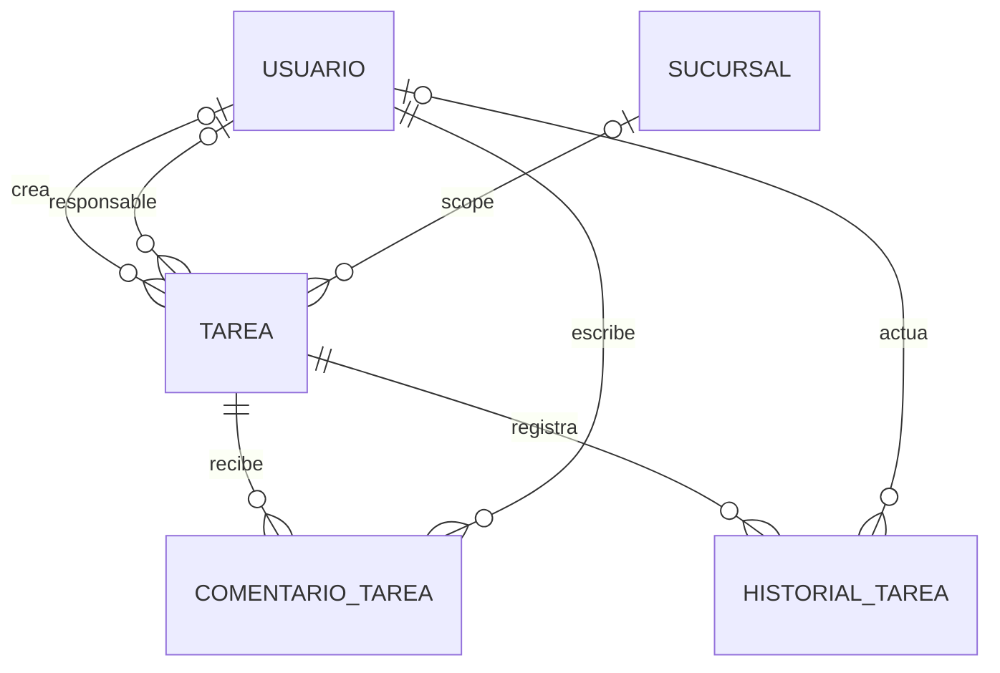

# GOP-DER-001 — DER Gestión Operativa — MVP inicial de Tarea

## 1. Metadatos

| Dato | Valor |
| --- | --- |
| Identificador documental | `GOP-DER-001` |
| Dominio | `gestion_operativa` |
| Versión | `1.0` |
| Estado | Propuesto para revisión formal |
| Incremento | Issue #528 |
| Baseline | `main` — `56a60341916d8c7d7151566783f015d7d7452f29` |
| Dependencia normativa | `DEV-ARCH-GOP-001` |

## 2. Propósito y alcance

Este DER materializa la estructura conceptual del MVP inicial de Tarea definida
por `DEV-ARCH-GOP-001`. El dominio contiene exactamente tres entidades propias:
`Tarea`, `ComentarioTarea` e `HistorialTarea`.

El documento habilita el diseño posterior de servicios (`DEV-SRV`). No implementa
SQL, migrations, endpoints, DTO, runtime, tests ni frontend; tampoco fija nombres
físicos definitivos ni amplía el MVP.

## 3. Fuentes y prevalencia

Fuentes principales:

1. `AGENTS.md`.
2. `backend/documentacion/DEV-ARCH/dominios/gestion_operativa/DEV-ARCH-GOP-001.md`.
3. SQL real, sólo como evidencia de owners, relaciones y convenciones CORE-EF.
4. Implementación y tests reales, cuando materializan contratos vigentes.
5. Issues y PR vigentes: #528, #523, PR #524, #527 y #522.
6. `PROJECT-STATUS.md` y `CODEX-WORKFLOW.md`.
7. `GOP-FREEZE-001` y documentación histórica como contexto subordinado.

Ante contradicción rige el orden: `AGENTS.md` → `DEV-ARCH-GOP-001` → SQL →
implementación → tests → issues/PR → `PROJECT-STATUS.md` →
`CODEX-WORKFLOW.md` → documentación histórica. No se detectó una contradicción
material que obligue a reabrir la arquitectura. El estado desactualizado de #523
en documentos operativos es una diferencia de seguimiento, no de diseño.

## 4. Clasificación y ownership

### 4.1 Clasificación semántica

| Elemento | Clasificación semántica |
| --- | --- |
| `Tarea` | Núcleo del dominio |
| `ComentarioTarea` | Núcleo del dominio |
| `HistorialTarea` | Núcleo del dominio |
| Identidad, autenticación y autorización provistas por Administrativo | Soporte transversal |
| Metadata y versionado CORE-EF, idempotencia, procedencia técnica, outbox, inbox, sync, retry, `PENDING_DEPENDENCY`, fencing, lease y operation scope aplicables | Soporte transversal |
| Antiguos `CU-OPER-*` y cualquier modelo legacy de tareas | Compatibilidad heredada / documentación histórica desalineada; no se adopta como modelo principal de Gestión Operativa |

Esta clasificación semántica no modifica aggregate boundaries ni naturaleza
técnica: `Tarea` continúa como aggregate root, `ComentarioTarea` como append
sincronizable independiente e `HistorialTarea` como append funcional interno.
Clasificar una capacidad como soporte transversal tampoco transfiere su
ownership a GOP.

### 4.2 Ownership

| Dominio owner | Responsabilidad |
| --- | --- |
| Gestión Operativa | `Tarea`, `ComentarioTarea`, `HistorialTarea` y lifecycle funcional de Tarea |
| Administrativo | `usuario`, autenticación/autorización humana, roles y permisos |
| Operativo | `sucursal` e `instalacion` |
| Técnico / CORE-EF / Sync | `op_id`, `operacion_idempotente`, outbox, inbox, retry, fencing, lease y operation scope |

Las estructuras transversales no son entidades GOP ni trasladan ownership. El
DER no crea ledger, outbox, inbox, dependencia pendiente o conflicto propios.

## 5. Diagrama DER



Cardinalidades y condiciones:

- el creador admite estructuralmente `0..1` usuario; es obligatorio cuando
  `origen = USUARIO` y debe ser `NULL` para el futuro `origen = SISTEMA`, según
  la invariante cruzada con `generador_sistema`;
- el responsable existe como máximo uno y es nullable en la estructura general;
  su presencia es obligatoria en `EN_CURSO` y `COMPLETADA`, según la invariante
  cruzada de estado;
- la sucursal funcional es opcional y existe como máximo una; `NULL` significa
  alcance global;
- todo comentario pertenece a una Tarea y tiene autor humano obligatorio;
- toda entrada de historial pertenece a una Tarea;
- el actor del historial es condicional por tipo de hecho y obligatorio para
  `REABIERTA`;
- instalación no es scope funcional y por eso no aparece como relación funcional
  del diagrama; interviene sólo en procedencia CORE-EF de las entidades
  sincronizables.

El diagrama expresa cardinalidad estructural. La regla condicional creador/origen
no puede expresarse completamente mediante la cardinalidad Mermaid.

## 6. Tarea

### 6.1 Rol estructural

`Tarea` es el aggregate root, snapshot funcional versionado, entidad
sincronizable y autoridad del lifecycle. La creación nace en versión 1 y no usa
versión esperada. Toda mutación material posterior avanza exactamente
`Vn → Vn+1`; la estrategia física de CAS se difiere.

### 6.2 Matriz estructural

| Campo conceptual | Obligatorio | Mutable | Relación / naturaleza |
| --- | --- | --- | --- |
| PK local | Sí | No | Identidad local para joins y FK |
| `uid_global` | Sí | No | Identidad portable propia, única, inmutable y no reutilizable |
| `version_registro` | Sí | Incremental | Versión del snapshot; nace en 1 |
| `origen` | Sí | No | `USUARIO`; `SISTEMA` reservado |
| creador | Condicional | No | FK local a `usuario` |
| `generador_sistema` | Condicional | No | Descriptor funcional, no credencial |
| título | Sí | Sólo si lifecycle editable | Texto no nullable, funcionalmente no vacío y con contenido textual real |
| descripción | No | Sólo si lifecycle editable | Texto funcional |
| prioridad | Sí | Sólo si lifecycle editable | `BAJA` / `NORMAL` / `ALTA` / `URGENTE`; orden semántico `BAJA < NORMAL < ALTA < URGENTE`; al omitirse en creación adopta conceptualmente `NORMAL` |
| responsable | Condicional por estado | Sólo si lifecycle editable | FK local a `usuario`; máximo uno; obligatorio en `EN_CURSO` y `COMPLETADA` |
| `fecha_objetivo` | No | Sólo si lifecycle editable | `DATE` funcional |
| estado | Sí | Transición válida | `PENDIENTE` / `EN_CURSO` / `COMPLETADA` / `CANCELADA`; el único estado inicial es `PENDIENTE` |
| `fecha_finalizacion` | Sólo en `COMPLETADA` | Derivada | Instante vigente generado por servidor al completar; `NULL` en los demás estados |
| sucursal | No | No en MVP | FK local a `sucursal`; `NULL` global |
| `deleted_at` | No | Baja futura | Soft delete técnico, distinto del lifecycle |
| metadata CORE-EF | Según contrato | Según mutación | Identidad, causalidad y procedencia técnica |

No se congelan longitudes ni tipos SQL; `DATE` para `fecha_objetivo` es una
decisión funcional ya cerrada. El default conceptual `NORMAL` de prioridad y el
estado inicial único `PENDIENTE` son reglas de creación, pero este DER no decide
si se protegerán mediante `DEFAULT` SQL, validación de aplicación u otro
mecanismo posterior.

La prioridad conserva el orden semántico `BAJA < NORMAL < ALTA < URGENTE`.
Afecta únicamente ordenamiento, filtros y señalización visual: no cambia estado
ni vencimiento, no modifica permisos/autorización o locks, no introduce SLA y no
dispara automatización. La implementación física del orden permanece diferida.

`VENCIDA` no es un estado ni un campo persistido, sino una proyección de consulta
definida conceptualmente por la regla completa:

```text
VENCIDA =
  deleted_at ausente
  AND fecha_objetivo no nula
  AND estado IN (PENDIENTE, EN_CURSO)
  AND fecha_objetivo < fecha_corte_local
```

La `fecha_corte_local` conserva la semántica definida por `DEV-ARCH-GOP-001`.
Por lo tanto, una Tarea con baja técnica no se proyecta como vencida.

### 6.3 Coherencia estructural del snapshot por estado

| Estado | Responsable | `fecha_finalizacion` vigente |
| --- | --- | --- |
| `PENDIENTE` | `0..1`; puede ser `NULL` | `NULL` |
| `EN_CURSO` | Obligatorio | `NULL` |
| `COMPLETADA` | Obligatorio | Obligatoria; generada por servidor al completar |
| `CANCELADA` | `0..1`; no es obligatorio por el solo estado | `NULL` |

Esta matriz congela presencia y nulabilidad conceptual. Un snapshot
`EN_CURSO` o `COMPLETADA` con responsable `NULL` es inválido; también lo son
`COMPLETADA` con `fecha_finalizacion = NULL` y cualquier estado restante con
`fecha_finalizacion != NULL`.

La presencia del responsable no demuestra su elegibilidad. La evaluación de
usuario, sucursal y vínculo vigentes, intervalo temporal, `puede_operar` y
autorización Administrativa efectiva permanece en application layer / DEV-SRV.
Este DER no decide `CHECK`, trigger ni otro mecanismo físico para estas reglas.

### 6.4 Mutabilidad y terminalidad

`PENDIENTE` y `EN_CURSO` son los estados editables del snapshot, siempre sujetos
a transición válida, autorización y demás reglas funcionales aplicables. Título,
descripción, prioridad, responsable y fecha objetivo sólo admiten modificación
ordinaria mientras el lifecycle sea editable. El campo estado nunca es edición
libre: cambia únicamente mediante una transición válida de lifecycle.

`COMPLETADA` y `CANCELADA` congelan el snapshot funcional. Mientras una Tarea
permanece `COMPLETADA` no admite edición ordinaria; la única mutación de Tarea
permitida es la reapertura explícita `COMPLETADA → PENDIENTE` con sus invariantes
ya definidas. `CANCELADA` no reabre y no admite mutación ordinaria del snapshot.

Congelar el snapshot de Tarea no prohíbe agregar `ComentarioTarea`: cuando la
autorización aplicable lo permita, el comentario sigue siendo válido en
`COMPLETADA` y `CANCELADA` como append independiente. No reabre ni modifica el
snapshot, no incrementa `Tarea.version_registro` y no usa su CAS ni
`If-Match-Version`.

### 6.5 Metadata CORE-EF

Tarea requiere conceptualmente el bloque aplicable completo:

- `uid_global`;
- `version_registro`;
- `created_at`;
- `updated_at`;
- `deleted_at`;
- instalación de origen;
- instalación de última modificación;
- `op_id_alta`;
- `op_id_ultima_modificacion`.

`Tarea.uid_global` es obligatorio, único, inmutable y no reutilizable. Su
unicidad CORE-EF no está diferida: sólo permanecen pendientes el nombre físico
del constraint, el nombre físico del índice y los detalles SQL de protección.

Los nombres físicos de las FK de instalación permanecen sujetos a la convención
CORE-EF que se confirme al diseñar SQL. La instalación conserva ownership
Operativo y no define visibilidad ni scope funcional de Tarea.

## 7. ComentarioTarea

### 7.1 Rol estructural

`ComentarioTarea` es un append funcional y sincronizable independiente. Tiene
identidad distribuida, versión e idempotencia propias; no es parte del snapshot
mutable de Tarea.

### 7.2 Matriz estructural

| Campo conceptual | Obligatorio | Mutable | Relación / naturaleza |
| --- | --- | --- | --- |
| PK local | Sí | No | Identidad local |
| `uid_global` | Sí | No | Identidad portable propia, única, inmutable y no reutilizable |
| `version_registro` | Sí | No ordinariamente | Versión propia e independiente de Tarea; valor inicial obligatorio `1`; en el MVP append-only normalmente permanece en `1` |
| Tarea | Sí | No | FK local obligatoria a Tarea |
| autor | Sí | No | FK local obligatoria a `usuario` |
| texto | Sí | No | Contenido funcional append-only |
| instante funcional | Sí | No | Instante de ocurrencia |
| metadata CORE-EF | Según contrato | No ordinariamente | Bloque de entidad sincronizable |

Su metadata CORE-EF comprende conceptualmente `uid_global`,
`version_registro`, `created_at`, `updated_at`, `deleted_at`, instalaciones de
origen y última modificación, `op_id_alta` y `op_id_ultima_modificacion`. Esto no
habilita edición ni borrado funcional en el MVP.

`ComentarioTarea.uid_global` es obligatorio, único, inmutable y no reutilizable.
Su unicidad CORE-EF tampoco está diferida; sólo se difieren los nombres físicos
del constraint y del índice y sus detalles SQL de implementación.

La creación de todo ComentarioTarea establece conceptualmente
`ComentarioTarea.version_registro = 1` de manera obligatoria. Su evolución es
una dimensión distinta: por ser append-only en el MVP, normalmente permanece en
`1`. Esta versión es propia e independiente de `Tarea.version_registro`; el DER
no decide `DEFAULT`, trigger, `CHECK` ni estrategia SQL de inicialización.

Agregar un comentario:

- no incrementa `Tarea.version_registro`;
- no participa del CAS de Tarea;
- no usa versión esperada ni `If-Match-Version` de Tarea;
- no se edita ni se borra funcionalmente;
- no genera un historial duplicado de comentarios.

Puede agregarse, con autorización aplicable, aunque la Tarea esté `COMPLETADA` o
`CANCELADA`; esa operación no altera la terminalidad ni el snapshot de Tarea.

## 8. HistorialTarea

### 8.1 Rol estructural

`HistorialTarea` es append funcional interno, no root y no sincronizable de
manera autónoma. Se genera atómicamente por la operación de Tarea y converge como
parte de su efecto causal. No es un event store ni la autoridad para reconstruir
el snapshot.

### 8.2 Matriz estructural

| Campo conceptual | Obligatorio | Mutable | Relación / naturaleza |
| --- | --- | --- | --- |
| PK local | Sí | No | Identidad exclusivamente local |
| Tarea | Sí | No | FK local obligatoria |
| tipo de hecho | Sí | No | Discriminador funcional |
| actor | Condicional | No | FK local a `usuario` |
| instante funcional | Sí | No | Instante del hecho |
| `op_id` causal | Sí | No | Correlación con la operación de Tarea |
| evidencia anterior | Según hecho | No | Representación física diferida |
| evidencia nueva | Según hecho | No | Representación física diferida |
| motivo | Para `REABIERTA` | No | Evidencia funcional obligatoria |
| finalización anterior | Cuando aplica | No | Evidencia de lifecycle previo |

Aplicabilidad explícita:

| Capacidad | HistorialTarea |
| --- | --- |
| `uid_global` propio | NO APLICA |
| `version_registro` propio | NO APLICA |
| bloque CORE-EF independiente | NO APLICA |
| sync autónomo | NO APLICA |
| outbox propio | NO APLICA |
| CAS, retry, consumer o conflicto propios | NO APLICA |
| soft delete propio | NO APLICA |

No se impone todavía unicidad sobre `op_id`: una operación indivisible puede
requerir una o más filas de evidencia y esa granularidad pertenece a DEV-SRV/SQL.

### 8.3 Catálogo conceptual mínimo

El historial debe soportar hechos funcionales equivalentes a:

- `CREADA`;
- `CONTENIDO_MODIFICADO`;
- `ASIGNADA`;
- `REASIGNADA`;
- `DESASIGNADA`;
- `PRIORIDAD_MODIFICADA`;
- `FECHA_OBJETIVO_MODIFICADA`;
- `ESTADO_MODIFICADO`;
- `COMPLETADA`;
- `CANCELADA`;
- `REABIERTA`.

No se fijan códigos físicos. Para `REABIERTA` la estructura debe permitir exigir
actor humano, instante, motivo, estado anterior `COMPLETADA`, estado nuevo
`PENDIENTE` y finalización anterior. El postestado queda cerrado
conceptualmente:

```text
REABIERTA
estado: COMPLETADA → PENDIENTE
Tarea.fecha_finalizacion vigente → NULL
finalización anterior → evidencia en HistorialTarea
```

Por lo tanto, una Tarea reabierta no puede conservar simultáneamente
`estado = PENDIENTE` y `fecha_finalizacion != NULL`. La entrada de historial
preserva además actor humano obligatorio, motivo obligatorio, instante y `op_id`
causal. La forma física de proteger estas reglas permanece diferida.

La representación de evidencia anterior/nueva queda deliberadamente abierta:
este DER no elige JSON libre, EAV, snapshots completos ni una tabla auxiliar de
valores.

## 9. Referencias externas y portabilidad

El patrón obligatorio es:

```text
GOP persiste FK local
→ entidad owner
→ owner.uid_global
→ producer serializa owner.uid_global
→ receptor resuelve uid_global → PK local
→ GOP persiste FK local resuelta
```

| Referencia GOP | Persistencia local | Identidad portable | Owner |
| --- | --- | --- | --- |
| creador | FK a `usuario` | `usuario.uid_global` | Administrativo |
| responsable | FK nullable a `usuario` | `usuario.uid_global` | Administrativo |
| autor de comentario | FK a `usuario` | `usuario.uid_global` | Administrativo |
| actor de historial | FK condicional a `usuario` | `usuario.uid_global` | Administrativo |
| sucursal funcional | FK nullable a `sucursal` | `sucursal.uid_global` | Operativo |
| instalación de procedencia | FK CORE-EF local | `instalacion.uid_global` en metadata/envelope | Operativo |

GOP no duplica `usuario.uid_global`, `sucursal.uid_global` ni
`instalacion.uid_global`. Ninguna PK remota viaja. El soft delete del owner
conserva su fila e identidad portable para trazabilidad y resolución.
Técnico consume `instalacion.uid_global` como contexto/procedencia en
metadata/envelope CORE-EF/Sync, sin adquirir ownership ni definir semántica de
instalación.

## 10. Invariantes estructurales congeladas

- Tarea y ComentarioTarea tienen UID propio, obligatorio, único, inmutable y no
  reutilizable; HistorialTarea no.
- Tarea y ComentarioTarea tienen versionado propio; HistorialTarea no.
- Todo ComentarioTarea nace obligatoriamente con `version_registro = 1`; su
  versión es independiente de Tarea y en el MVP append-only normalmente
  permanece en `1`.
- ComentarioTarea e HistorialTarea pertenecen siempre a una Tarea.
- El comentario tiene autor humano obligatorio.
- El historial conserva el `op_id` causal de la operación de Tarea.
- Responsable y sucursal admiten como máximo una referencia cada uno.
- `PENDIENTE` admite responsable `NULL`; `EN_CURSO` y `COMPLETADA` exigen
  responsable; `CANCELADA` no lo exige por el solo estado. La presencia no
  sustituye la elegibilidad vigente, que corresponde a application layer.
- Creador y generador son condicionales y excluyentes según origen: para
  `USUARIO`, creador obligatorio y generador `NULL`; para `SISTEMA`, creador
  `NULL` y generador obligatorio. `SISTEMA` permanece deshabilitado en el MVP.
- El título es no nullable, funcionalmente no vacío y conserva contenido textual
  real; su protección física se define después.
- Prioridad y estado pertenecen a catálogos conceptuales cerrados; prioridad se
  ordena semánticamente como `BAJA < NORMAL < ALTA < URGENTE`, la omitida en
  creación adopta conceptualmente `NORMAL` y toda Tarea se crea únicamente en
  `PENDIENTE`. Prioridad sólo afecta ordenamiento, filtros y señalización visual;
  no altera estado, vencimiento, permisos/autorización, locks, SLA ni dispara
  automatización.
- `VENCIDA` es una proyección no persistida que exige `deleted_at` ausente,
  `fecha_objetivo` no nula, estado `PENDIENTE` o `EN_CURSO`, y
  `fecha_objetivo < fecha_corte_local`.
- `deleted_at` es independiente de `CANCELADA` y del lifecycle.
- `REABIERTA` exige actor y motivo, además de evidencia del estado/finalización
  anteriores; cambia `COMPLETADA → PENDIENTE`, limpia la
  `fecha_finalizacion` vigente y conserva la finalización anterior en
  HistorialTarea.
- `COMPLETADA` exige `fecha_finalizacion` vigente, generada por servidor al
  completar; `PENDIENTE`, `EN_CURSO` y `CANCELADA` exigen
  `fecha_finalizacion = NULL`.
- `PENDIENTE` y `EN_CURSO` admiten edición ordinaria según reglas aplicables;
  `COMPLETADA` y `CANCELADA` congelan el snapshot. `COMPLETADA` sólo admite la
  reapertura explícita a `PENDIENTE`; `CANCELADA` no reabre.
- Los comentarios autorizados en estados terminales siguen siendo appends
  independientes y no mutan, reabren, versionan ni usan el CAS de Tarea.
- La metadata CORE-EF no duplica semántica funcional.
- Las referencias externas persisten FK local y no copian UID del owner.
- La sucursal funcional es nullable, inmutable en MVP y `NULL` significa global.
- Instalación expresa procedencia técnica, no scope funcional.
- Un comentario no versiona Tarea ni usa su CAS.
- Historial no tiene outbox, retry, consumer, CAS o conflicto autónomos.
- La futura generación con origen `SISTEMA` combina idempotencia técnica por
  `op_id` con idempotencia funcional por hecho fuente; reprocesar el mismo hecho
  fuente con otro `op_id` no crea una segunda Tarea funcional equivalente.

## 11. Responsabilidades posteriores

### 11.1 SQL

Quedan para el diseño físico:

- nombres definitivos de tablas y columnas;
- tipos y longitudes finales;
- `CHECK`, enums físicos, FK, defaults y triggers;
- nombres físicos del constraint de unicidad y del índice CORE-EF de UID, cuya
  existencia obligatoria no está diferida;
- índices finales adicionales y unicidades específicas del dominio;
- protección física de inmutabilidad;
- estrategia concreta de CAS;
- reglas físicas de timestamps y metadata CORE-EF.

### 11.2 Application layer / DEV-SRV

Quedan para servicios y contratos posteriores:

- lifecycle contextual y elegibilidad continua del responsable;
- generación server-side de `fecha_finalizacion` al completar;
- autorización y visibilidad;
- idempotencia y frontera transaccional concreta;
- continuidad remota y representación de gaps;
- `PENDING_DEPENDENCY`, retry, replay y conflicto;
- causalidad de comentarios frente a baja;
- fecha de corte para `VENCIDA`;
- auth/authz antes de cualquier replay o conflicto observable;
- nombres y granularidad de commands/eventos.

## 12. Consultas que la estructura debe soportar

La futura persistencia debe permitir:

- obtener y listar Tareas;
- “Mis tareas” y “Tareas creadas por mí”;
- pendientes, vencidas derivadas y sin asignar;
- filtros por responsable, creador, estado, sucursal, prioridad y fecha objetivo;
- consultar comentarios;
- consultar historial.

El índice de `uid_global` de Tarea y ComentarioTarea es obligatorio por CORE-EF;
sólo su nombre y forma física permanecen diferidos. Son candidatos para evaluar
índices adicionales: baja lógica, responsable, creador, estado, sucursal,
prioridad, fecha objetivo y las FK de comentario/historial a Tarea. Esta lista no
congela esos índices adicionales.

## 13. Sync y portabilidad

- Tarea viaja por `Tarea.uid_global` y su continuidad de versión.
- ComentarioTarea viaja por `ComentarioTarea.uid_global` y su versión propia.
- Las referencias humanas viajan por `usuario.uid_global`.
- La sucursal funcional viaja por `sucursal.uid_global` cuando está presente.
- La instalación portable pertenece al envelope/metadata técnica.
- HistorialTarea no tiene UID propio; el descriptor causal suficiente viaja como
  parte de la operación de Tarea para materializarlo determinísticamente.
- No se transportan ni almacenan PK remotas.
- Se reutiliza la infraestructura transversal; no se crean tablas Sync GOP.

## 14. Origen SISTEMA reservado

El modelo permite proteger conceptualmente estas formas:

| Origen | Creador | `generador_sistema` |
| --- | --- | --- |
| `USUARIO` | Obligatorio | `NULL` |
| `SISTEMA` | `NULL` | Obligatorio |

El MVP habilita únicamente `USUARIO`. `SISTEMA` permanece reservado: #522 sigue
abierto, no bloquea el MVP humano y es prerequisito de cualquier automatización.
No se materializa una identidad humana ficticia para procesos técnicos ni se
crean credenciales, service accounts o API keys.

Cuando `SISTEMA` se habilite en un incremento futuro deberán coexistir dos
garantías distintas, sin que una sustituya a la otra:

```text
op_id → idempotencia técnica de la operación
hecho fuente → idempotencia funcional de la generación
```

Reprocesar el mismo hecho fuente con un `op_id` distinto no puede crear una
segunda Tarea funcional equivalente. `op_id` no es la identidad funcional del
hecho fuente. Este DER congela sólo esa invariante funcional: no define ni agrega
una columna, FK, entidad, tabla, ledger, constraint o índice para materializarla.

## 15. Fuera de alcance post-MVP

El conjunto de #527 permanece completo fuera del DER. No se agregan tablas ni
campos de preparación para agenda completa, recordatorios, alertas,
notificaciones, recurrencia, subtareas, dependencias, múltiples responsables,
equipos, sectores, Kanban, SLA, workflows configurables, adjuntos, generación
automática efectiva, control de mora, relaciones polimórficas, incidencias,
novedades, observaciones, frontend avanzado o dashboard analítico.

## 16. NO CONFIRMADO / DIFERIDO

Los siguientes puntos no bloquean el DER y no se deciden aquí:

- nombres físicos definitivos de tablas y columnas;
- tipos y longitudes de textos;
- `CHECK` frente a enum físico;
- nombres y detalles SQL del constraint único y del índice obligatorio de
  `uid_global`; la unicidad, inmutabilidad y no reutilización CORE-EF no están
  diferidas;
- representación física de evidencia anterior/nueva;
- catálogo físico de tipos de historial;
- unicidades de HistorialTarea relacionadas con `op_id`;
- índices finales adicionales;
- estrategia física de CAS;
- representación y tratamiento técnico de gaps de continuidad;
- clasificación terminal de un comentario causalmente posterior a baja;
- granularidad exacta entre una operación de Tarea y sus filas de historial.
- representación física de la identidad funcional del hecho fuente para el
  futuro origen `SISTEMA`: nombre de campo, tipo, longitud, clave natural, UUID,
  hash, referencia externa, constraint, índice, unicidad SQL, tabla auxiliar,
  fingerprint, algoritmo de deduplicación, command/evento y producer concretos.

## 17. Criterio de suficiencia

El DER queda estructuralmente suficiente para iniciar DEV-SRV cuando una revisión
formal confirme: exactamente tres entidades GOP propias; ownership preservado;
Tarea como root versionada; ComentarioTarea como append sincronizable
independiente; HistorialTarea interno sin identidad distribuida; referencias
externas sin UID duplicados; separación entre lifecycle, soft delete, scope y
procedencia; y ausencia de capacidades de #527, SQL, API o runtime anticipados.
