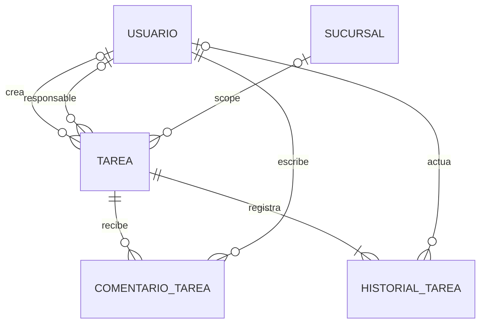

# GOP-DER-001 — DER Gestión Operativa — MVP inicial de Tarea

## 1. Metadatos

| Dato | Valor |
| --- | --- |
| Identificador documental | `GOP-DER-001` |
| Dominio | `gestion_operativa` |
| Versión | `1.0` |
| Estado | Propuesto para revisión formal |
| Incremento | Issue #528 |
| Baseline | `main` — `56a60341916d8c7d7151566783f015d7d7452f29` |
| Dependencia normativa | `DEV-ARCH-GOP-001` |

## 2. Propósito y alcance

Este DER materializa la estructura conceptual del MVP inicial de Tarea definida
por `DEV-ARCH-GOP-001`. El dominio contiene exactamente tres entidades propias:
`Tarea`, `ComentarioTarea` e `HistorialTarea`.

El documento habilita el diseño posterior de servicios (`DEV-SRV`). No implementa
SQL, migrations, endpoints, DTO, runtime, tests ni frontend; tampoco fija nombres
físicos definitivos ni amplía el MVP.

## 3. Fuentes y prevalencia

Fuentes principales:

1. `AGENTS.md`.
2. `backend/documentacion/DEV-ARCH/dominios/gestion_operativa/DEV-ARCH-GOP-001.md`.
3. SQL real, sólo como evidencia de owners, relaciones y convenciones CORE-EF.
4. Implementación y tests reales, cuando materializan contratos vigentes.
5. Issues y PR vigentes: #528, #523, PR #524, #527 y #522.
6. `PROJECT-STATUS.md` y `CODEX-WORKFLOW.md`.
7. `GOP-FREEZE-001` y documentación histórica como contexto subordinado.

Ante contradicción rige el orden: `AGENTS.md` → `DEV-ARCH-GOP-001` → SQL →
implementación → tests → issues/PR → `PROJECT-STATUS.md` →
`CODEX-WORKFLOW.md` → documentación histórica. No se detectó una contradicción
material que obligue a reabrir la arquitectura. El estado desactualizado de #523
en documentos operativos es una diferencia de seguimiento, no de diseño.

## 4. Clasificación y ownership

### 4.1 Clasificación semántica

| Elemento | Clasificación semántica |
| --- | --- |
| `Tarea` | Núcleo del dominio |
| `ComentarioTarea` | Núcleo del dominio |
| `HistorialTarea` | Núcleo del dominio |
| Identidad, autenticación y autorización provistas por Administrativo | Soporte transversal |
| Metadata y versionado CORE-EF, idempotencia, procedencia técnica, outbox, inbox, sync, retry, `PENDING_DEPENDENCY`, fencing, lease y operation scope aplicables | Soporte transversal |
| Antiguos `CU-OPER-*` y cualquier modelo legacy de tareas | Compatibilidad heredada / documentación histórica desalineada; no se adopta como modelo principal de Gestión Operativa |

Esta clasificación semántica no modifica aggregate boundaries ni naturaleza
técnica: `Tarea` continúa como aggregate root, `ComentarioTarea` como append
sincronizable independiente e `HistorialTarea` como append funcional interno.
Clasificar una capacidad como soporte transversal tampoco transfiere su
ownership a GOP.

### 4.2 Ownership

| Dominio owner | Responsabilidad |
| --- | --- |
| Gestión Operativa | `Tarea`, `ComentarioTarea`, `HistorialTarea` y lifecycle funcional de Tarea |
| Administrativo | `usuario`, autenticación/autorización humana, roles y permisos |
| Operativo | `sucursal` e `instalacion` |
| Técnico / CORE-EF / Sync | `op_id`, `operacion_idempotente`, outbox, inbox, retry, fencing, lease y operation scope |

Las estructuras transversales no son entidades GOP ni trasladan ownership. El
DER no crea ledger, outbox, inbox, dependencia pendiente o conflicto propios.

## 5. Diagrama DER



Cardinalidades y condiciones:

- el creador admite estructuralmente `0..1` usuario; es obligatorio cuando
  `origen = USUARIO` y debe ser `NULL` para el futuro `origen = SISTEMA`, según
  la invariante cruzada con `generador_sistema`;
- el responsable existe como máximo uno y es nullable en la estructura general;
  su presencia es obligatoria en `EN_CURSO` y `COMPLETADA`, según la invariante
  cruzada de estado;
- la sucursal funcional es opcional y existe como máximo una; `NULL` significa
  alcance global;
- todo comentario pertenece a una Tarea y tiene autor humano obligatorio;
- toda Tarea confirmada registra `1..N` entradas de historial y toda entrada de
  historial pertenece exactamente a una Tarea;
- el actor del historial es condicional por tipo de hecho y obligatorio para
  `REABIERTA`;
- instalación no es scope funcional y por eso no aparece como relación funcional
  del diagrama; interviene sólo en procedencia CORE-EF de las entidades
  sincronizables.

El diagrama expresa cardinalidad estructural. La regla condicional creador/origen
no puede expresarse completamente mediante la cardinalidad Mermaid.

## 6. Tarea

### 6.1 Rol estructural

`Tarea` es el aggregate root, snapshot funcional versionado, entidad
sincronizable y autoridad del lifecycle. La creación nace en versión 1 y no usa
versión esperada, CAS ni `If-Match-Version` de Tarea porque no existe snapshot
previo; no se inventa una versión 0. Toda mutación material posterior de una
Tarea existente/versionada exige que la versión esperada del command coincida
con la versión local actual `Vn`; sólo entonces puede confirmar exactamente
`Vn → Vn+1`. Si el snapshot actual difiere de la versión esperada, la mutación
no puede confirmar el efecto como si aún operara sobre `Vn`.

La obligación conceptual de versión esperada/CAS no está diferida. Permanecen
diferidos únicamente su forma física —incluidos `UPDATE` condicionado, rowcount,
repository, trigger, error y representación final de `If-Match-Version`—. Agregar
ComentarioTarea es la excepción independiente: no usa versión esperada, CAS ni
`If-Match-Version` de Tarea y no incrementa `Tarea.version_registro`.

### 6.2 Matriz estructural

| Campo conceptual | Obligatorio | Mutable | Relación / naturaleza |
| --- | --- | --- | --- |
| PK local | Sí | No | Identidad local para joins y FK |
| `uid_global` | Sí | No | Identidad portable propia, única, inmutable y no reutilizable |
| `version_registro` | Sí | Incremental | Versión del snapshot; nace en 1 |
| `origen` | Sí | No | `USUARIO`; `SISTEMA` reservado |
| creador | Condicional | No | FK local a `usuario` |
| `generador_sistema` | Condicional | No | Descriptor funcional, no credencial |
| título | Sí | Sólo si lifecycle editable | Texto no nullable, funcionalmente no vacío y con contenido textual real |
| descripción | No | Sólo si lifecycle editable | Texto funcional |
| prioridad | Sí | Sólo si lifecycle editable | `BAJA` / `NORMAL` / `ALTA` / `URGENTE`; orden semántico `BAJA < NORMAL < ALTA < URGENTE`; al omitirse en creación adopta conceptualmente `NORMAL` |
| responsable | Condicional por estado | Sólo si lifecycle editable | FK local a `usuario`; máximo uno; obligatorio en `EN_CURSO` y `COMPLETADA` |
| `fecha_objetivo` | No | Sólo si lifecycle editable | `DATE` funcional |
| estado | Sí | Transición válida | `PENDIENTE` / `EN_CURSO` / `COMPLETADA` / `CANCELADA`; el único estado inicial es `PENDIENTE` |
| `fecha_finalizacion` | Sólo en `COMPLETADA` | Derivada | Instante vigente generado por servidor al completar; `NULL` en los demás estados |
| sucursal | No | No en MVP | FK local a `sucursal`; `NULL` global |
| `deleted_at` | No | Baja futura | Soft delete técnico, distinto del lifecycle |
| metadata CORE-EF | Según contrato | Según mutación | Identidad, causalidad y procedencia técnica |

No se congelan longitudes ni tipos SQL; `DATE` para `fecha_objetivo` es una
decisión funcional ya cerrada. El default conceptual `NORMAL` de prioridad y el
estado inicial único `PENDIENTE` son reglas de creación, pero este DER no decide
si se protegerán mediante `DEFAULT` SQL, validación de aplicación u otro
mecanismo posterior.

La prioridad conserva el orden semántico `BAJA < NORMAL < ALTA < URGENTE`.
Afecta únicamente ordenamiento, filtros y señalización visual: no cambia estado
ni vencimiento, no modifica permisos/autorización o locks, no introduce SLA y no
dispara automatización. La implementación física del orden permanece diferida.

`VENCIDA` no es un estado ni un campo persistido, sino una proyección de consulta
definida conceptualmente por la regla completa:

```text
VENCIDA =
  deleted_at ausente
  AND fecha_objetivo no nula
  AND estado IN (PENDIENTE, EN_CURSO)
  AND fecha_objetivo < fecha_corte_local
```

Para cada caso de uso relevante, `fecha_corte_local` se captura una sola vez
desde un reloj confiable del servidor y se proyecta en la zona IANA
`America/Argentina/Buenos_Aires`. No proviene del cliente, la instalación ni el
timezone de la sesión PostgreSQL. La comparación es estrictamente entre valores
`DATE`: si `fecha_objetivo == fecha_corte_local`, la Tarea no está vencida durante
ese día. Una Tarea con baja técnica no se proyecta como vencida y una Tarea
reabierta puede volver a proyectarse vencida si conserva una fecha objetivo
anterior al corte.

Esta semántica temporal no está diferida. Sólo permanecen posteriores la
implementación concreta del reloj, librería/helper, SQL de comparación y manejo
físico del timezone.

### 6.3 Coherencia estructural del snapshot por estado

| Estado | Responsable | `fecha_finalizacion` vigente |
| --- | --- | --- |
| `PENDIENTE` | `0..1`; puede ser `NULL` | `NULL` |
| `EN_CURSO` | Obligatorio | `NULL` |
| `COMPLETADA` | Obligatorio | Obligatoria; generada por servidor al completar |
| `CANCELADA` | `0..1`; no es obligatorio por el solo estado | `NULL` |

Esta matriz congela presencia y nulabilidad conceptual. Un snapshot
`EN_CURSO` o `COMPLETADA` con responsable `NULL` es inválido; también lo son
`COMPLETADA` con `fecha_finalizacion = NULL` y cualquier estado restante con
`fecha_finalizacion != NULL`.

La presencia del responsable no demuestra su elegibilidad. La evaluación de
usuario, sucursal y vínculo vigentes, intervalo temporal, `puede_operar` y
autorización Administrativa efectiva permanece en application layer / DEV-SRV.
Este DER no decide `CHECK`, trigger ni otro mecanismo físico para estas reglas.

### 6.4 Grafo cerrado de lifecycle

El lifecycle admite exclusivamente las siguientes transiciones conceptuales:

| Desde | Hacia | Condición |
| --- | --- | --- |
| `PENDIENTE` | `EN_CURSO` | Responsable vigente/elegible obligatorio |
| `PENDIENTE` | `COMPLETADA` | Responsable vigente/elegible obligatorio; no exige paso previo por `EN_CURSO` |
| `PENDIENTE` | `CANCELADA` | Autorización aplicable |
| `EN_CURSO` | `PENDIENTE` | Responsable vigente/elegible o administración aplicable |
| `EN_CURSO` | `COMPLETADA` | Responsable vigente/elegible obligatorio |
| `EN_CURSO` | `CANCELADA` | Autorización aplicable |
| `COMPLETADA` | `PENDIENTE` | Sólo mediante reapertura explícita `REABIERTA`, con motivo y postestado válido |
| `CANCELADA` | Ninguno | Terminal; no reabre |

No existe ninguna otra transición. Este grafo es conceptual: no congela
commands, endpoints, `CHECK`, triggers ni una state machine física. La
elegibilidad y autorización efectivas continúan en application layer / DEV-SRV.
La reapertura conserva íntegramente las reglas de actor, motivo,
`fecha_finalizacion`, evidencia histórica y reparación del responsable descritas
en HistorialTarea.

### 6.5 Mutabilidad y terminalidad

`PENDIENTE` y `EN_CURSO` son los estados editables del snapshot, siempre sujetos
a transición válida, autorización y demás reglas funcionales aplicables. Título,
descripción, prioridad, responsable y fecha objetivo sólo admiten modificación
ordinaria mientras el lifecycle sea editable. El campo estado nunca es edición
libre: cambia únicamente mediante una transición válida de lifecycle.

`COMPLETADA` y `CANCELADA` congelan el snapshot funcional. Mientras una Tarea
permanece `COMPLETADA` no admite edición ordinaria; la única mutación de Tarea
permitida es la reapertura explícita `COMPLETADA → PENDIENTE` con sus invariantes
ya definidas. `CANCELADA` no reabre y no admite mutación ordinaria del snapshot.

Congelar el snapshot de Tarea no prohíbe agregar `ComentarioTarea`: cuando la
autorización aplicable lo permita, el comentario sigue siendo válido en
`COMPLETADA` y `CANCELADA` como append independiente. No reabre ni modifica el
snapshot, no incrementa `Tarea.version_registro` y no usa su CAS ni
`If-Match-Version`.

### 6.6 Metadata CORE-EF

Tarea requiere conceptualmente el bloque aplicable completo:

- `uid_global`;
- `version_registro`;
- `created_at`;
- `updated_at`;
- `deleted_at`;
- instalación de origen;
- instalación de última modificación;
- `op_id_alta`;
- `op_id_ultima_modificacion`.

`Tarea.uid_global` es obligatorio, único, inmutable y no reutilizable. Su
unicidad CORE-EF no está diferida: sólo permanecen pendientes el nombre físico
del constraint, el nombre físico del índice y los detalles SQL de protección.

Los nombres físicos de las FK de instalación permanecen sujetos a la convención
CORE-EF que se confirme al diseñar SQL. La instalación conserva ownership
Operativo y no define visibilidad ni scope funcional de Tarea.

### 6.7 Identidad humana y creador

En el MVP humano, `origen = USUARIO` vincula obligatoriamente el creador al
principal autenticado vigente:

```text
Bearer
→ AuthenticatedPrincipal vigente
→ creador local = AuthenticatedPrincipal.id_usuario
→ creador portable = usuario.uid_global del mismo owner
```

El creador no es un dato libre del caller. No puede provenir del body/payload,
`X-Usuario-Id`, query param, path param, login, email, código de usuario, PK
remota ni otro valor declarado arbitrariamente por el cliente. La FK local sirve
para persistencia y joins; la portabilidad usa el `usuario.uid_global` del mismo
owner Administrativo. Esta regla no altera el branch reservado `SISTEMA`:
creador `NULL`, `generador_sistema` obligatorio y origen aún deshabilitado hasta
resolver #522, sin usuario SYSTEM, principal ficticio ni service account.

Como regla transversal del MVP, `Authorization: Bearer` →
`AuthenticatedPrincipal` vigente es la única fuente autoritativa de identidad
humana **actuante/caller** GOP. Comprende al creador efectivo de una Tarea
humana, autor efectivo de ComentarioTarea, actor efectivo de HistorialTarea
—incluida `REABIERTA`—, caller de commands y consultas protegidas, usuario
implícito de “Mis tareas” y “Tareas creadas por mí” y cualquier otra identidad
que represente al usuario que actúa.

Esta regla no convierte las identidades humanas **objetivo** de una operación en
el caller. Un responsable inicial, nuevo responsable o destino de reasignación
puede ser otro usuario distinto del `AuthenticatedPrincipal`, siempre que el
caller esté autorizado y el target satisfaga las reglas aplicables. El target se
recibe exclusivamente mediante la referencia funcional explícita permitida por
el command, se valida contra Administrativo y se resuelve a su
`usuario.id` local; cuando debe viajar, se representa con el
`usuario.uid_global` portable del mismo owner. Por ejemplo, es válido:

```text
caller administrador = AuthenticatedPrincipal.id_usuario
responsable solicitado = otro usuario elegible
responsable portable = usuario.uid_global del target
```

En creación, el creador sigue siendo el principal actuante, mientras el
responsable inicial puede ser otro target elegible. En reasignación, el actor es
el principal y el nuevo responsable es el target validado. En `REABIERTA`, el
actor es el principal, pero la reparación puede conservar al responsable
elegible, dejarlo `NULL` o elegir otro target elegible. El autor de comentario
y el usuario implícito de “Mis tareas” no admiten selector arbitrario: son el
principal actuante.

`X-Usuario-Id` no se requiere, parsea, compara ni utiliza para identidad o
autorización actuante, y tampoco selecciona un target funcional. No sustituye ni
complementa `AuthenticatedPrincipal`, no funciona como fallback o cross-check
y su presencia o ausencia no define al actor. Ninguna identidad humana viaja
como `X-Usuario-Id`, PK local, login, email o código. Esta prohibición no agrega
`X-Usuario-Id` al helper ni a los tres headers técnicos CORE-EF requeridos.

La baja o desactivación posterior del usuario creador no invalida la Tarea ni
elimina su identidad histórica: la FK y el UID del owner conservan la
trazabilidad del alta.

Autenticación/identidad del creador y autorización para elegir el scope son
precondiciones distintas. Toda creación humana exige además administración
aplicable sobre el scope funcional propuesto:

```text
id_sucursal != NULL
→ administración vigente sobre esa sucursal
  AND autorización efectiva Administrativa suficiente

id_sucursal = NULL
→ Tarea global
→ alcance global administrativo vigente
  AND autorización efectiva Administrativa suficiente
```

Estar autenticado, ser usuario activo, responsable, creador, tener
`puede_operar` o acceso a otra sucursal no sustituye la administración aplicable
al scope propuesto. `NULL` no omite la validación: significa scope global. Esta
regla consume autorización de Administrativo y no crea ACL, tabla de scope, FK,
copia de permisos ni rol GOP.

`X-Sucursal-Id` y `X-Instalacion-Id` expresan contexto/procedencia técnica del
command; no asignan `Tarea.id_sucursal`, no autentican personas y no convierten
instalación en scope funcional. El scope se toma exclusivamente de la decisión
funcional autorizada de creación. Si la sucursal persistida deja de estar
vigente, la Tarea conserva `id_sucursal` y el resto del snapshot: no se convierte
en global ni se muta automáticamente. Su gestión residual requiere el alcance
global administrativo ya definido.

### 6.8 Elegibilidad temporal del responsable

La elegibilidad se evalúa completa usando un único `instante_corte_utc`,
capturado una sola vez por caso de uso desde un reloj confiable del servidor en
UTC. No proviene del cliente, navegador, sucursal, instalación ni timezone de la
sesión PostgreSQL.

Para una Tarea de sucursal deben cumplirse simultáneamente:

```text
usuario vigente =
  estado_usuario = ACTIVO
  AND usuario.deleted_at IS NULL
  AND usuario.fecha_baja IS NULL

sucursal vigente =
  estado_sucursal = ACTIVA
  AND sucursal.deleted_at IS NULL
  AND sucursal.fecha_baja IS NULL

vínculo usuario_sucursal vigente =
  usuario_sucursal.deleted_at IS NULL
  AND estado_vinculo = ACTIVO
  AND fecha_desde_utc <= instante_corte_utc
  AND (
    fecha_hasta_utc IS NULL
    OR instante_corte_utc < fecha_hasta_utc
  )

responsable elegible =
  usuario vigente
  AND sucursal vigente
  AND vínculo usuario_sucursal vigente
  AND puede_operar = true
  AND autorización efectiva Administrativa suficiente
```

El intervalo es semiabierto `[fecha_desde, fecha_hasta)`: incluye exactamente
`fecha_desde` y excluye exactamente `fecha_hasta`. `puede_operar` aislado no
alcanza. Para Tarea global se requiere el alcance global operativo vigente
equivalente y autorización Administrativa suficiente; su representación sigue
bajo ownership Administrativo.

Toda nueva entrada autoritativa de `fecha_desde`/`fecha_hasta` llega con offset
explícito, se normaliza a UTC y se compara como instante UTC. Si posteriormente
se persiste como `timestamp without time zone`, sólo puede interpretarse como
UTC canónico cuando la entrada original tenía offset explícito y fue normalizada
previamente. El timezone de sesión no es autoridad. Valores legacy naïve sin
offset no se reinterpretan silenciosamente: antes de autorizar visibilidad,
elegibilidad, asignación o mutación requieren migración/backfill explícito o una
regla legacy documentada y validada; este DER no elige entre esas estrategias.

### 6.9 Visibilidad y autorización humana

GOP declara relaciones funcionales habilitantes y consume autorización efectiva
de Administrativo; no crea ACL, IAM, roles ni tablas de permisos. Toda operación
humana protegida exige simultáneamente una relación funcional habilitante y
autorización Administrativa efectiva. Bearer → `AuthenticatedPrincipal` vigente
y la autorización actual aplicable preceden cualquier respuesta observable de
`claim_operation` y gatean `EXECUTE`, `REPLAY` y `CONFLICT`; conocer un `op_id` o
receipt no concede acceso.

La autorización actual de acceso se distingue de las precondiciones mutables de
la ejecución original. Un caller actualmente autenticado y autorizado que
presenta el mismo `op_id`, envelope compatible y una operación ya completada
recibe `REPLAY` durable sin repetir efecto ni outbox. Después de superar esa
autorización actual, el replay puede devolver el resultado durable sin reevaluar
lifecycle, versión actual/esperada original, elegibilidad, estado del target u
otras precondiciones mutables necesarias sólo para ejecutar el efecto original.
El replay no es una nueva ejecución. Un caller distinto, sin autorización actual
o que perdió una base válida de acceso no recibe el resultado por conocer el
`op_id`; autorización nunca se desplaza detrás de una respuesta observable de
claim/replay/conflict.

Con autorización efectiva correspondiente, son bases independientes de
visibilidad:

1. ser creador humano;
2. ser responsable registrado y conservar elegibilidad vigente;
3. tener consulta vigente sobre la sucursal de una Tarea scoped;
4. tener administración vigente sobre esa sucursal;
5. para Tarea global, tener consulta global o administración global vigente;
6. para Tarea cuyo scope dejó de estar vigente, tener administración global
   vigente.

`Mis tareas` incluye exclusivamente Tareas cuyo responsable registrado es el
usuario y sigue elegible. `Tareas creadas por mí` es una consulta independiente
por autoría: el creador conserva esa base aunque no sea responsable, haya sido
reasignada o desasignada, siempre sujeto a autorización efectiva.

`puede_administrar` constituye una base propia de visibilidad, pero no implica ni
deriva `puede_consultar`; este último tampoco habilita mutación por sí solo. Una
Tarea con `responsable = NULL` sigue siendo visible cuando existe otra base
independiente válida, como creador o consulta/administración aplicable del scope.

| Acción | Creador por esa sola relación | Responsable vigente/elegible | Administración aplicable |
| --- | --- | --- | --- |
| Ver | Sí | Sí | Sí |
| Comentar | Sí | Sí | Sí |
| Modificar título/descripción | No | No | Sí |
| Asignar/reasignar/desasignar | No | No | Sí |
| Cambiar prioridad/fecha objetivo | No | No | Sí |
| Cambiar `PENDIENTE ↔ EN_CURSO` | No | Sí | Sí |
| Completar | No | Sí | Sí, sólo con responsable elegible |
| Cancelar | No | No | Sí |
| Reabrir `COMPLETADA → PENDIENTE` | No | No | Sí |

Administración aplicable significa alcance global para Tarea global,
administración vigente sobre la sucursal vigente o fallback de administración
global si esa sucursal dejó de estar vigente. Siempre se respetan autorización,
lifecycle y elegibilidad. Si el responsable pierde elegibilidad, no se
desasigna, reasigna, cancela ni cambia estado automáticamente, pero pierde `Mis
tareas`, visibilidad por responsabilidad y todas las capacidades derivadas de
ser responsable; sólo conserva acceso por otra base independiente válida. Toda
gestión posterior requiere una mutación explícita autorizada.

### 6.10 Envelope e idempotencia conceptual

GOP reutiliza `public.operacion_idempotente`; no crea ledger propio. Cada command
futuro define conceptualmente como mínimo `command_code`, `target_type`,
`target_uid` o `target_key`, payload material canonicalizable, versión esperada
cuando aplica, fingerprint, snapshot durable de replay y completion.

El orden contractual es:

```text
parseo / normalización suficiente
→ construcción del fingerprint
→ claim
→ efecto material
```

Todo ocurre dentro de la transacción coordinada. En commands humanos,
autenticación y autorización actuales preceden cualquier respuesta observable
del claim. El mismo `op_id` con envelope compatible permite replay conforme a la
sección anterior; el mismo `op_id` con envelope materialmente incompatible
produce `CONFLICT` y no se trata como replay.

Permanecen diferidos schema, hash y versión de canonicalización concretos,
clases, repository, DTO y códigos HTTP. No están diferidos la composición
conceptual del envelope, el orden del claim ni la distinción replay/conflicto.

### 6.11 Clasificación CORE-EF de operaciones

Las clasificaciones conceptuales ya congeladas son:

| Operación conceptual | Clasificación CORE-EF | Sincronización/outbox |
| --- | --- | --- |
| Crear o mutar snapshot de Tarea | `COMMAND_WRITE_NEGOCIO` | `SINCRONIZABLE`; genera outbox transaccional |
| Agregar ComentarioTarea | `COMMAND_WRITE_NEGOCIO` | `SINCRONIZABLE`; evento/outbox propio |
| Baja lógica futura de Tarea | `COMMAND_WRITE_TECNICO` | `SINCRONIZABLE`; genera outbox transaccional |
| Consultas | `QUERY_READLIKE` | No generan outbox |

Crear o mutar snapshot comprende contenido, asignación/reasignación/
desasignación, prioridad, fecha objetivo, lifecycle, completar, cancelar y
reabrir. La baja conserva naturaleza técnica aunque afecte Tarea.

Todo write GOP clasificado `SINCRONIZABLE` debe obtener y validar su contexto
técnico mediante el helper común CORE-EF y exige obligatoriamente
`X-Op-Id`, `X-Sucursal-Id` y `X-Instalacion-Id`. Esta regla transversal cubre
la creación y las mutaciones de Tarea, el alta independiente de
ComentarioTarea y la baja lógica futura:

- `X-Op-Id` aporta la identidad técnica portable `op_id` de la operación y
  alimenta su contrato de idempotencia; no identifica personas, no autentica y
  no concede autorización;
- `X-Sucursal-Id` aporta contexto técnico de ejecución/procedencia; no asigna
  `Tarea.id_sucursal`, no determina el scope funcional y no concede
  autorización sobre una sucursal;
- `X-Instalacion-Id` aporta contexto/procedencia técnica de instalación; no
  determina scope funcional, sucursal de Tarea, creador, responsable ni
  autorización humana.

El helper común CORE-EF es la frontera conceptual obligatoria para aplicar este
contrato uniformemente; los writes sincronizables no definen parsing o
validación ad hoc por endpoint. `Authorization: Bearer` →
`AuthenticatedPrincipal` continúa siendo la fuente independiente de identidad
y autorización humana, y ninguno de los tres headers técnicos la sustituye.
Sólo la procedencia técnica portable admitida por el contrato transversal puede
integrar el envelope durable; estos headers no habilitan material de
autenticación en payload/outbox.

Permanecen diferidos endpoints, métodos HTTP, command/event codes, schemas,
routers, dependency o middleware concretos, nombre y firma del helper, tipos,
parsing y validadores físicos, wiring, códigos de error y SQL. No están
diferidas la clasificación, la reutilización obligatoria del helper común
CORE-EF ni la obligatoriedad de los tres headers.

Para estas operaciones se congela `lock lógico = NO APLICA`. Esto no elimina ni
debilita CAS, `If-Match-Version`, `version_registro`, idempotencia, atomicidad,
transacción ni fencing Técnico. No se introduce lock GOP adicional.

## 7. ComentarioTarea

### 7.1 Rol estructural

`ComentarioTarea` es un append funcional y sincronizable independiente. Tiene
identidad distribuida, versión e idempotencia propias; no es parte del snapshot
mutable de Tarea.

### 7.2 Matriz estructural

| Campo conceptual | Obligatorio | Mutable | Relación / naturaleza |
| --- | --- | --- | --- |
| PK local | Sí | No | Identidad local |
| `uid_global` | Sí | No | Identidad portable propia, única, inmutable y no reutilizable |
| `version_registro` | Sí | No ordinariamente | Versión propia e independiente de Tarea; valor inicial obligatorio `1`; en el MVP append-only normalmente permanece en `1` |
| Tarea | Sí | No | FK local obligatoria a Tarea |
| autor | Sí | No | FK local obligatoria a `usuario` |
| texto | Sí | No | Contenido funcional append-only |
| instante funcional | Sí | No | Instante de ocurrencia |
| metadata CORE-EF | Según contrato | No ordinariamente | Bloque de entidad sincronizable |

Su metadata CORE-EF comprende conceptualmente `uid_global`,
`version_registro`, `created_at`, `updated_at`, `deleted_at`, instalaciones de
origen y última modificación, `op_id_alta` y `op_id_ultima_modificacion`. Esto no
habilita edición ni borrado funcional en el MVP.

`ComentarioTarea.uid_global` es obligatorio, único, inmutable y no reutilizable.
Su unicidad CORE-EF tampoco está diferida; sólo se difieren los nombres físicos
del constraint y del índice y sus detalles SQL de implementación.

La creación de todo ComentarioTarea establece conceptualmente
`ComentarioTarea.version_registro = 1` de manera obligatoria. Su evolución es
una dimensión distinta: por ser append-only en el MVP, normalmente permanece en
`1`. Esta versión es propia e independiente de `Tarea.version_registro`; el DER
no decide `DEFAULT`, trigger, `CHECK` ni estrategia SQL de inicialización.

Agregar un comentario:

- no incrementa `Tarea.version_registro`;
- no participa del CAS de Tarea;
- no usa versión esperada ni `If-Match-Version` de Tarea;
- no se edita ni se borra funcionalmente;
- no genera un historial duplicado de comentarios.

Puede agregarse, con autorización aplicable, aunque la Tarea esté `COMPLETADA` o
`CANCELADA`; esa operación no altera la terminalidad ni el snapshot de Tarea.

### 7.3 Causalidad frente a baja lógica

El orden de entrega no redefine el orden causal. La semántica funcional queda
congelada así:

- un comentario confirmado causalmente antes de la baja es válido y debe
  converger, incluso si otra instalación recibe y aplica primero la baja;
- un comentario y una baja causalmente concurrentes conservan ambos efectos; la
  baja no invalida retroactivamente el append concurrente válido;
- un intento de comentario causalmente posterior a la baja no es una mutación
  ordinaria válida.

Por lo tanto, recibir la baja antes que el comentario no basta para descartar el
comentario. `deleted_at` es baja técnica, no hard delete ni `CANCELADA`, y no
elimina comentarios válidos anteriores o concurrentes. Permanecen diferidos
únicamente el mecanismo técnico de detección/reconciliación y la clasificación
terminal exacta del intento causalmente posterior, incluidos código de error,
respuesta HTTP y detalle del consumer. Esta causalidad no introduce versión
esperada ni CAS contra Tarea para comentar.

## 8. HistorialTarea

### 8.1 Rol estructural

`HistorialTarea` es append funcional interno, no root y no sincronizable de
manera autónoma. Se genera atómicamente por la operación de Tarea y converge como
parte de su efecto causal. No es un event store ni la autoridad para reconstruir
el snapshot.

### 8.2 Matriz estructural

| Campo conceptual | Obligatorio | Mutable | Relación / naturaleza |
| --- | --- | --- | --- |
| PK local | Sí | No | Identidad exclusivamente local |
| Tarea | Sí | No | FK local obligatoria |
| tipo de hecho | Sí | No | Discriminador funcional |
| actor | Condicional | No | FK local a `usuario` |
| instante funcional | Sí | No | Instante del hecho |
| `op_id` causal | Sí | No | Correlación con la operación de Tarea |
| evidencia anterior | Según hecho | No | Representación física diferida |
| evidencia nueva | Según hecho | No | Representación física diferida |
| motivo | Para `REABIERTA` | No | Evidencia funcional obligatoria |
| finalización anterior | Cuando aplica | No | Evidencia de lifecycle previo |

Aplicabilidad explícita:

| Capacidad | HistorialTarea |
| --- | --- |
| `uid_global` propio | NO APLICA |
| `version_registro` propio | NO APLICA |
| bloque CORE-EF independiente | NO APLICA |
| sync autónomo | NO APLICA |
| outbox propio | NO APLICA |
| CAS, retry, consumer o conflicto propios | NO APLICA |
| soft delete propio | NO APLICA |

No se impone todavía unicidad sobre `op_id`: una operación indivisible puede
requerir una o más filas de evidencia y esa granularidad pertenece a DEV-SRV/SQL.

Toda creación confirmada de Tarea genera obligatoriamente una entrada
`HistorialTarea` de tipo `CREADA`. Una Tarea confirmada con cero entradas de
historial es estructuralmente inválida respecto del contrato GOP. La primera
entrada pertenece a la misma operación y transacción funcional de creación:

```text
Tarea
+ HistorialTarea(CREADA)
+ outbox
+ receipt idempotente
→ misma transacción conceptual
```

Para el MVP con `origen = USUARIO`, `CREADA` conserva la Tarea obligatoria, el
actor humano correspondiente, el instante, el `op_id` causal y evidencia
funcional suficiente para explicar el alta. El actor del futuro origen `SISTEMA`
no se define aquí ni se habilita ese origen. La forma física de la evidencia y
del mecanismo transaccional permanece diferida.

### 8.3 Fronteras atómicas conceptuales

La frontera de creación anterior es un caso particular de una regla general.
Toda mutación sincronizable exitosa de Tarea comparte una única unidad atómica:

```text
claim idempotente
+ efecto funcional sobre Tarea
+ HistorialTarea aplicable
+ outbox
+ receipt idempotente durable
→ misma transacción conceptual
```

La regla comprende toda mutación material, incluidas creación, contenido,
asignación, reasignación, desasignación, prioridad, fecha objetivo, lifecycle,
completar, cancelar, reabrir y la baja lógica futura. La baja sólo genera una
entrada funcional de HistorialTarea si un contrato funcional posterior determina
que corresponde; eso no altera su atomicidad CORE-EF.

Agregar `ComentarioTarea` usa su propia unidad atómica independiente:

```text
claim idempotente
+ ComentarioTarea
+ outbox
+ receipt idempotente durable
→ misma transacción conceptual
```

Un fallo previo al commit revierte todos los efectos de la unidad. No puede
confirmarse Tarea o ComentarioTarea sin su outbox y receipt, ni historial sin el
cambio de Tarea correspondiente, ni receipt sin efecto funcional. El comentario
no muta Tarea, no genera HistorialTarea duplicado, no incrementa
`Tarea.version_registro` y no usa su CAS.

El Application Service / Orchestrator es el owner de commit y rollback de toda
la unidad. Los repositories operan dentro de la `Session` o unidad transaccional
provista y no hacen commit ni rollback internos. Este ownership conceptual no
está diferido: un commit interno podría confirmar Tarea sin historial/outbox o
ComentarioTarea sin receipt. Permanecen diferidos únicamente la implementación
del Unit of Work, las APIs internas de repository, el manejo físico de `Session`,
el orden SQL, el framework transaccional y la estrategia concreta de excepciones.

### 8.4 Catálogo conceptual mínimo

El historial debe soportar hechos funcionales equivalentes a:

- `CREADA`;
- `CONTENIDO_MODIFICADO`;
- `ASIGNADA`;
- `REASIGNADA`;
- `DESASIGNADA`;
- `PRIORIDAD_MODIFICADA`;
- `FECHA_OBJETIVO_MODIFICADA`;
- `ESTADO_MODIFICADO`;
- `COMPLETADA`;
- `CANCELADA`;
- `REABIERTA`.

No se fijan códigos físicos. Para `REABIERTA` la estructura debe permitir exigir
actor humano, instante, motivo, estado anterior `COMPLETADA`, estado nuevo
`PENDIENTE` y finalización anterior. El postestado queda cerrado
conceptualmente:

```text
REABIERTA
estado: COMPLETADA → PENDIENTE
Tarea.fecha_finalizacion vigente → NULL
finalización anterior → evidencia en HistorialTarea
responsable anterior aún elegible → puede conservarse
responsable anterior inelegible → responsable = NULL
                              o reemplazo por responsable elegible
```

Por lo tanto, una Tarea reabierta no puede conservar simultáneamente
`estado = PENDIENTE` y `fecha_finalizacion != NULL`. La entrada de historial
preserva además actor humano obligatorio, motivo obligatorio, instante y `op_id`
causal. La reapertura nunca puede producir una Tarea activa con responsable
inelegible y no introduce autoasignación. La presencia del responsable continúa
siendo distinta de su elegibilidad; application layer / DEV-SRV evalúa usuario,
sucursal y vínculo vigentes, intervalo temporal, `puede_operar` y autorización
Administrativa efectiva, y decide en la misma operación lógica entre conservar,
dejar `NULL` o reemplazar. La forma física de proteger estas reglas permanece
diferida.

La representación de evidencia anterior/nueva queda deliberadamente abierta:
este DER no elige JSON libre, EAV, snapshots completos ni una tabla auxiliar de
valores.

## 9. Referencias externas y portabilidad

El patrón obligatorio es:

```text
GOP persiste FK local
→ entidad owner
→ owner.uid_global
→ producer serializa owner.uid_global
→ receptor resuelve uid_global → PK local
→ GOP persiste FK local resuelta
```

| Referencia GOP | Persistencia local | Identidad portable | Owner |
| --- | --- | --- | --- |
| creador | FK a `usuario` | `usuario.uid_global` | Administrativo |
| responsable | FK nullable a `usuario` | `usuario.uid_global` | Administrativo |
| autor de comentario | FK a `usuario` | `usuario.uid_global` | Administrativo |
| actor de historial | FK condicional a `usuario` | `usuario.uid_global` | Administrativo |
| sucursal funcional | FK nullable a `sucursal` | `sucursal.uid_global` | Operativo |
| instalación de procedencia | FK CORE-EF local | `instalacion.uid_global` en metadata/envelope | Operativo |

GOP no duplica `usuario.uid_global`, `sucursal.uid_global` ni
`instalacion.uid_global`. Ninguna PK remota viaja. El soft delete del owner
conserva su fila e identidad portable para trazabilidad y resolución.
Técnico consume `instalacion.uid_global` como contexto/procedencia en
metadata/envelope CORE-EF/Sync, sin adquirir ownership ni definir semántica de
instalación.

## 10. Invariantes estructurales congeladas

- Tarea y ComentarioTarea tienen UID propio, obligatorio, único, inmutable y no
  reutilizable; HistorialTarea no.
- Tarea y ComentarioTarea tienen versionado propio; HistorialTarea no.
- La creación de Tarea nace en `version_registro = 1` sin versión esperada, CAS
  ni `If-Match-Version` de Tarea. Toda mutación material de una Tarea existente
  en `Vn` exige versión esperada `Vn` y sólo puede confirmar `Vn → Vn+1`; un
  mismatch impide confirmar el efecto sobre la versión obsoleta.
- Todo ComentarioTarea nace obligatoriamente con `version_registro = 1`; su
  versión es independiente de Tarea y en el MVP append-only normalmente
  permanece en `1`.
- Todo ComentarioTarea pertenece siempre a una Tarea. Toda Tarea confirmada tiene
  `1..N` entradas HistorialTarea y cada entrada pertenece exactamente a una
  Tarea; la creación genera obligatoriamente `HistorialTarea(CREADA)` en la misma
  transacción conceptual que Tarea, outbox y receipt idempotente.
- El comentario tiene autor humano obligatorio.
- El historial conserva el `op_id` causal de la operación de Tarea.
- Responsable y sucursal admiten como máximo una referencia cada uno.
- `PENDIENTE` admite responsable `NULL`; `EN_CURSO` y `COMPLETADA` exigen
  responsable; `CANCELADA` no lo exige por el solo estado. La presencia no
  sustituye la elegibilidad vigente, que corresponde a application layer.
- Creador y generador son condicionales y excluyentes según origen: para
  `USUARIO`, creador obligatorio y generador `NULL`; para `SISTEMA`, creador
  `NULL` y generador obligatorio. `SISTEMA` permanece deshabilitado en el MVP.
- En creación humana, el creador se deriva exclusivamente de Bearer →
  `AuthenticatedPrincipal.id_usuario`; no se acepta desde payload,
  `X-Usuario-Id`, parámetros, login, email, código ni PK remota.
- Crear con sucursal concreta exige administración vigente y autorización
  efectiva sobre esa sucursal; crear con sucursal `NULL` exige alcance global
  administrativo vigente y autorización efectiva. Identidad del creador no
  sustituye autorización sobre el scope propuesto.
- El título es no nullable, funcionalmente no vacío y conserva contenido textual
  real; su protección física se define después.
- Prioridad y estado pertenecen a catálogos conceptuales cerrados; prioridad se
  ordena semánticamente como `BAJA < NORMAL < ALTA < URGENTE`, la omitida en
  creación adopta conceptualmente `NORMAL` y toda Tarea se crea únicamente en
  `PENDIENTE`. Prioridad sólo afecta ordenamiento, filtros y señalización visual;
  no altera estado, vencimiento, permisos/autorización, locks, SLA ni dispara
  automatización.
- `VENCIDA` es una proyección no persistida que exige `deleted_at` ausente,
  `fecha_objetivo` no nula, estado `PENDIENTE` o `EN_CURSO`, y
  `fecha_objetivo < fecha_corte_local`; el corte se captura una vez desde reloj
  de servidor y se proyecta a `America/Argentina/Buenos_Aires`, con comparación
  `DATE` estricta e igualdad no vencida.
- `deleted_at` es independiente de `CANCELADA` y del lifecycle.
- `REABIERTA` exige actor y motivo, además de evidencia del estado/finalización
  anteriores; cambia `COMPLETADA → PENDIENTE`, limpia la
  `fecha_finalizacion` vigente y conserva la finalización anterior en
  HistorialTarea.
- `COMPLETADA` exige `fecha_finalizacion` vigente, generada por servidor al
  completar; `PENDIENTE`, `EN_CURSO` y `CANCELADA` exigen
  `fecha_finalizacion = NULL`.
- `PENDIENTE` y `EN_CURSO` admiten edición ordinaria según reglas aplicables;
  `COMPLETADA` y `CANCELADA` congelan el snapshot. `COMPLETADA` sólo admite la
  reapertura explícita a `PENDIENTE`; `CANCELADA` no reabre.
- El grafo cerrado admite únicamente `PENDIENTE → EN_CURSO`, `PENDIENTE →
  COMPLETADA`, `PENDIENTE → CANCELADA`, `EN_CURSO → PENDIENTE`, `EN_CURSO →
  COMPLETADA`, `EN_CURSO → CANCELADA` y `COMPLETADA → PENDIENTE` mediante
  `REABIERTA`; `CANCELADA` no tiene transición saliente.
- Los comentarios autorizados en estados terminales siguen siendo appends
  independientes y no mutan, reabren, versionan ni usan el CAS de Tarea.
- Comentarios confirmados antes de la baja o concurrentes con ella convergen y
  se conservan, aunque la baja se entregue primero; sólo el intento causalmente
  posterior a la baja no es una mutación ordinaria válida.
- La metadata CORE-EF no duplica semántica funcional.
- Las referencias externas persisten FK local y no copian UID del owner.
- La sucursal funcional es nullable, inmutable en MVP y `NULL` significa global.
- Los headers técnicos de sucursal/instalación no asignan scope funcional; una
  sucursal que pierde vigencia no globaliza ni muta automáticamente la Tarea.
- La baja o desactivación posterior del creador no invalida la Tarea ni elimina
  su identidad histórica.
- Instalación expresa procedencia técnica, no scope funcional.
- Un comentario no versiona Tarea ni usa su CAS.
- Historial no tiene outbox, retry, consumer, CAS o conflicto autónomos.
- Toda mutación sincronizable de Tarea confirma atómicamente claim, efecto,
  historial aplicable, outbox y receipt; agregar comentario confirma
  atómicamente claim, ComentarioTarea, outbox y receipt. Un fallo pre-commit
  revierte la unidad completa.
- Todo evento de Tarea permite reproducir exactamente su `Vn → Vn+1` y
  materializar HistorialTarea mediante descriptor causal, sin coalescer una
  operación intermedia necesaria ni inventar historial mediante diff. El evento
  de ComentarioTarea conserva su identidad, versión y causalidad independientes.
- Application Service / Orchestrator es owner de commit y rollback; los
  repositories participan en la transacción provista sin commit ni rollback
  internos.
- Misma versión y contenido con el mismo `op_id`/envelope compatible es replay;
  con `op_id` distinto es una operación materialmente convergente diferente que
  no muta ni versiona el snapshot y conserva trazabilidad/receipt separados.
- Una creación remota válida con versión `1` sobre `Tarea.uid_global` inexistente
  es candidata a materializar Tarea e `HistorialTarea(CREADA)` y no constituye
  gap; si el UID ya existe se aplican las reglas de continuidad y convergencia.
- Una referencia funcional portable válida, requerida y temporalmente ausente
  produce `PENDING_DEPENDENCY` sin aplicación parcial, placeholder ni PK remota;
  los `NULL` funcionalmente válidos, la procedencia técnica y los gaps de versión
  no pertenecen a esa clasificación GOP.
- La elegibilidad usa un único `instante_corte_utc` confiable del servidor y el
  intervalo `[fecha_desde, fecha_hasta)` normalizado desde entradas con offset;
  no depende del reloj cliente, timezone de sesión ni reinterpretación silenciosa
  de valores legacy naïve.
- Visibilidad y mutación humana exigen relación funcional habilitante y
  autorización Administrativa efectiva. Creador sólo obtiene ver/comentar;
  responsable elegible sólo las capacidades operativas de la matriz;
  administración aplicable conserva el scope global/sucursal/fallback.
- Administración y consulta son capacidades distintas; una Tarea sin responsable
  puede permanecer visible por creador o scope, y la pérdida de elegibilidad no
  desasigna, reasigna, cancela ni transiciona automáticamente.
- Autenticación y autorización actuales siempre gatean `EXECUTE`, `REPLAY` y
  `CONFLICT`; después de superarlas, un replay durable compatible no repite
  efecto/outbox y puede omitir precondiciones mutables de la ejecución original.
- Cada command define envelope idempotente conceptual, fingerprint y resultado
  durable; normaliza antes del claim y un mismo `op_id` con envelope incompatible
  produce `CONFLICT`.
- Tarea writes y ComentarioTarea son `COMMAND_WRITE_NEGOCIO + SINCRONIZABLE`;
  baja futura es `COMMAND_WRITE_TECNICO + SINCRONIZABLE`; consultas son
  `QUERY_READLIKE` sin outbox. `lock lógico = NO APLICA` sin debilitar CAS,
  idempotencia, transacción ni fencing Técnico.
- Tarea tiene criticidad Sync MEDIA: prohíbe LWW, auto-merge genérico y merge
  campo por campo; conflicto material conserva trazabilidad y toda resolución que
  modifique datos es una nueva operación con nuevo `op_id`.
- La futura generación con origen `SISTEMA` combina idempotencia técnica por
  `op_id` con idempotencia funcional por hecho fuente; reprocesar el mismo hecho
  fuente con otro `op_id` no crea una segunda Tarea funcional equivalente.
- Un hecho humano remoto confirmado en origen no se reautoriza contra roles,
  permisos, asignaciones o vínculos actuales; el receptor valida integridad,
  referencias, causalidad, continuidad, convergencia e invariantes materiales.
- El payload portable es allowlist/default-deny, excluye material de
  autenticación y PK locales y rechaza ese contenido antes de persistencia
  durable; timestamps no deciden autoridad.

## 11. Responsabilidades posteriores

### 11.1 SQL

Quedan para el diseño físico:

- nombres definitivos de tablas y columnas;
- tipos y longitudes finales;
- `CHECK`, enums físicos, FK, defaults y triggers;
- nombres físicos del constraint de unicidad y del índice CORE-EF de UID, cuya
  existencia obligatoria no está diferida;
- índices finales adicionales y unicidades específicas del dominio;
- protección física de inmutabilidad;
- estrategia concreta de CAS;
- representación física de la versión esperada y del CAS, cuyo uso conceptual
  en toda mutación de Tarea existente ya es obligatorio;
- reglas físicas de timestamps y metadata CORE-EF.

### 11.2 Application layer / DEV-SRV

Quedan para servicios y contratos posteriores:

- implementación del lifecycle contextual y de la elegibilidad continua cuyo
  predicado temporal y funcional ya está congelado;
- generación server-side de `fecha_finalizacion` al completar;
- implementación técnica de autenticación, autorización y visibilidad cuyas
  bases y matriz funcional ya están congeladas;
- implementación concreta de idempotencia y de la frontera transaccional ya
  congelada;
- lectura y validación de versión esperada, CAS concreto y clasificación del
  mismatch, sin alterar sus excepciones de creación y comentario;
- mecanismo técnico de espera, reordenamiento, reentrega y reconciliación de
  gaps de continuidad; el gate estricto de versión ya está congelado;
- implementación runtime y mecanismo Técnico de retry/reclaim para
  `PENDING_DEPENDENCY`; su frontera funcional ya está congelada;
- mecanismo técnico de causalidad comentario/baja y clasificación terminal
  exacta del intento causalmente posterior; la semántica funcional ya está
  congelada en este DER;
- implementación concreta del reloj, helper, librería y comparación física para
  `VENCIDA`; su corte único de servidor, zona Buenos Aires y semántica `DATE` ya
  están congelados;
- auth/authz antes de cualquier replay o conflicto observable;
- nombres y granularidad de commands/eventos.

## 12. Consultas que la estructura debe soportar

La futura persistencia debe permitir, siempre bajo la política de visibilidad de
la sección 6.9:

- obtener y listar Tareas;
- “Mis tareas” y “Tareas creadas por mí”;
- pendientes, vencidas derivadas y sin asignar;
- filtros por responsable, creador, estado, sucursal, prioridad y fecha objetivo;
- consultar comentarios;
- consultar historial.

Todas estas consultas ordinarias de Tarea excluyen registros con `deleted_at`
presente, incluidos obtener, listar, “Mis tareas”, “Tareas creadas por mí”,
pendientes, vencidas, sin asignar y cualquier filtro ordinario. Sólo vistas
técnicas o consultas explícitamente autorizadas para registros dados de baja
pueden incluirlos; este DER no diseña esas vistas ni introduce permisos nuevos.
La proyección `VENCIDA` conserva su regla única de la sección 6.2, que ya exige
`deleted_at` ausente.

Estas operaciones son `QUERY_READLIKE`: no generan outbox, locks ni efectos
persistentes. La falta de responsable no elimina una Tarea de las consultas si
el caller conserva otra base válida de visibilidad.

El índice de `uid_global` de Tarea y ComentarioTarea es obligatorio por CORE-EF;
sólo su nombre y forma física permanecen diferidos. Son candidatos para evaluar
índices adicionales: baja lógica, responsable, creador, estado, sucursal,
prioridad, fecha objetivo y las FK de comentario/historial a Tarea. Esta lista no
congela esos índices adicionales.

## 13. Sync y portabilidad

- Tarea viaja por `Tarea.uid_global` y su continuidad de versión.
- ComentarioTarea viaja por `ComentarioTarea.uid_global` y su versión propia.
- Las referencias humanas viajan por `usuario.uid_global`.
- La sucursal funcional viaja por `sucursal.uid_global` cuando está presente.
- La instalación portable pertenece al envelope/metadata técnica.
- HistorialTarea no tiene UID propio; el descriptor causal suficiente viaja como
  parte de la operación de Tarea para materializarlo determinísticamente.
- No se transportan ni almacenan PK remotas.
- Se reutiliza la infraestructura transversal; no se crean tablas Sync GOP.

Esa reutilización preserva tres identidades conceptuales distintas del contrato
Técnico:

- **Delivery** = identidad de entrega `(event_id, consumer)`;
- **Operation** = identidad material distribuida del consumidor
  `(consumer, op_id)`;
- **Attempt** = identidad de una adquisición o intento concreto `attempt_id`.

`event_id` identifica el evento/delivery, no la operación funcional global:
el mismo `event_id` con distinto `consumer` constituye distintas Delivery y
deduplicar la operación material sólo por `event_id` es incorrecto. `op_id`
identifica la operación dentro del scope del consumidor, no una delivery ni un
attempt; el mismo `op_id` con distinto `consumer` constituye distintas
Operation.

Cada retry o takeover por expiración de lease puede adquirir un nuevo
`attempt_id` para la misma Operation, sin crear ni repetir una nueva operación
funcional. `attempt_id` es distinto de `event_id`, `op_id` y `worker_id`;
este último sirve sólo para observabilidad y diagnóstico, no identifica
Delivery, Operation o Attempt ni constituye autoridad o fencing authority. El
fencing/takeover sigue perteneciendo al contrato Técnico transversal; este DER
no diseña columnas, tablas, índices, SQL, leases, tiempos, queries o scheduler
GOP propios.

### 13.1 Creación remota y gate estricto de continuidad de Tarea

Cuando no existe localmente una Tarea para el `Tarea.uid_global` recibido, una
operación de creación válida con `version_registro = 1` es candidata a
crear/materializar la Tarea local si supera las validaciones remotas definidas
abajo. Esta creación inicial no es un gap porque no
existe un snapshot local previo ni una versión intermedia faltante. Debe
materializar atómicamente la evidencia funcional `HistorialTarea(CREADA)` ya
exigida para toda creación confirmada; si falta temporalmente una referencia
funcional requerida, queda en `PENDING_DEPENDENCY` sin creación parcial ni
placeholder.

Si el mismo `uid_global` ya existe, el caso deja de ser creación sobre UID
inexistente y se evalúa mediante continuidad, replay, convergencia, obsolescencia
o conflicto; nunca crea una segunda Tarea con el mismo UID. Para una Tarea local
existente en `Vn`, sólo una entrada `Vn+1` es candidata inmediata a aplicar,
siempre que supere las validaciones remotas definidas abajo.
Una entrada `> Vn+1` constituye un gap: no se aplica inmediatamente ni adelanta
el snapshot. Un snapshot posterior no sustituye una mutación intermedia faltante,
porque se perdería silenciosamente su evidencia funcional de HistorialTarea.

| Entrada remota | Resultado conceptual |
| --- | --- |
| UID inexistente + creación válida con versión inicial `1` | Candidata a crear la Tarea y `HistorialTarea(CREADA)`; no es gap |
| Versión `Vn+1` sobre local `Vn` | Candidata a aplicar si satisface referencias e invariantes |
| Versión `> Vn+1` | Gap; no aplicar inmediatamente ni adelantar snapshot |
| Versión inferior a la local | No revierte snapshot; evaluar obsolescencia/idempotencia según operación conocida |
| Misma versión, mismo contenido y mismo `op_id`/envelope compatible | Replay o duplicado seguro; no repetir efecto |
| Misma versión y mismo contenido material, con `op_id` distinto | Operación distinta materialmente convergente: no es replay ni duplicado, no cambia el snapshot y conserva separadamente la trazabilidad y receipt de ambas operaciones |
| Misma versión y distinto contenido | Conflicto material |
| Timestamp más nuevo | Sin autoridad para saltar continuidad |

Tarea conserva criticidad de sincronización **MEDIA**. Ante una divergencia
material real no resuelta por reglas explícitas se prohíben LWW, auto-merge
genérico y merge automático campo por campo, incluso cuando los campos parezcan
disjuntos. El conflicto conserva trazabilidad suficiente de las operaciones
competidoras y ninguna se descarta o sustituye silenciosamente por timestamp.
Su persistencia técnica reutiliza la infraestructura de conflicto existente; no
se crea tabla GOP propia.

Si la resolución modifica estado funcional, exige una nueva operación trazable
con nuevo `op_id`: no edita en lugar de las operaciones originales, no reutiliza
sus `op_id` ni borra la trazabilidad del conflicto. La criticidad MEDIA no
transfiere ownership funcional a Técnico; GOP conserva la semántica de Tarea y
Técnico conserva la infraestructura de Sync/conflicto.

La identidad de operación no equivale al estado material resultante: dos
operaciones distintas pueden converger al mismo contenido sin convertirse en la
misma operación. Esa convergencia no produce una segunda mutación material ni un
incremento artificial de `Tarea.version_registro`.

No se usa LWW. Un gap no se clasifica automáticamente como
`PENDING_DEPENDENCY`, rechazo o conflicto. Sólo permanecen diferidos el mecanismo
técnico de espera/reordenamiento/reentrega, la clasificación técnica exacta y la
reconciliación, reutilizando la infraestructura Técnica existente sin tablas,
colas, inbox o retry GOP paralelos.

Un hecho humano confirmado válidamente en origen no se reautoriza
retrospectivamente en el receptor. El applicator no reevalúa contra el estado
humano actual roles, permisos, asignación, responsabilidad, vínculo
usuario-sucursal, otras relaciones humanas modificadas después ni la
autorización que hoy tendría el actor para ejecutar nuevamente el command.

El receptor sí valida integridad del payload, referencias portables requeridas,
causalidad, continuidad, idempotencia/convergencia, invariantes
estructurales/materiales del snapshot resultante y `PENDING_DEPENDENCY` cuando
corresponda. Esta regla de recepción remota es distinta del caller HTTP local
actual: en un command humano local, autenticación y autorización actuales siguen
gateando `EXECUTE`, `REPLAY` y `CONFLICT` antes de toda respuesta observable.

### 13.2 Frontera funcional de PENDING_DEPENDENCY

`PENDING_DEPENDENCY` aplica exclusivamente cuando una referencia funcional
portable, válida, requerida por la operación y temporalmente ausente impide
aplicar el efecto. No hay aplicación parcial, placeholder ni persistencia de PK
remota; la misma operación puede reintentarse cuando la dependencia aparezca.

| Referencia funcional | Ausencia temporal válida |
| --- | --- |
| Creador cuando la operación lo requiere | `PENDING_DEPENDENCY` |
| Responsable presente y requerido por el snapshot | `PENDING_DEPENDENCY` |
| Autor obligatorio de ComentarioTarea | `PENDING_DEPENDENCY` |
| Sucursal funcional concreta (`sucursal != NULL`) | `PENDING_DEPENDENCY` |
| Tarea padre requerida por ComentarioTarea | `PENDING_DEPENDENCY` |
| Actor humano portable obligatorio de `REABIERTA` | `PENDING_DEPENDENCY`; no se materializa la reapertura sin actor |
| Actor de HistorialTarea en otro hecho cuyo tipo exija actor humano | `PENDING_DEPENDENCY` mientras su UID portable requerido no pueda resolverse |

Una ausencia semánticamente válida no crea dependencia: `responsable = NULL`
cuando el snapshot lo admite y `sucursal = NULL` para una Tarea global no son
`PENDING_DEPENDENCY`. La instalación del envelope/metadata es procedencia
técnica, no referencia funcional GOP, y Técnico la clasifica según su contrato;
no es `PENDING_DEPENDENCY` GOP por defecto.

Payload inválido o referencia permanentemente inválida recibe la clasificación
funcional/Técnica correspondiente, no `PENDING_DEPENDENCY` automáticamente. Un
gap de `version_registro` tampoco es `PENDING_DEPENDENCY`: pertenece a
continuidad estricta. Scheduler, frecuencia, reentrega, reclaim, lease, operation
scope y mecanismo concreto de retry permanecen en Técnico/#512; no se crean
tablas, colas, placeholders ni infraestructura GOP paralela.

### 13.3 Suficiencia causal de eventos y outbox

Toda mutación sincronizable de Tarea produce, dentro de su frontera atómica,
información suficiente para reproducir exactamente el efecto remoto
`Vn → Vn+1`. El evento/envelope conserva conceptualmente:

- snapshot resultante necesario y `version_registro`;
- `op_id` y causalidad funcional;
- referencias portables requeridas;
- descriptor suficiente para materializar HistorialTarea sin inventarlo;
- procedencia técnica conforme al contrato transversal.

El productor/outbox preserva la posibilidad de entregar cada mutación necesaria
para continuidad estricta. No puede coalescer `V1 → V2 → V3` transportando sólo
V3 como sustituto de V2 cuando esa operación intermedia es necesaria. Un snapshot
posterior no reemplaza una versión faltante, y HistorialTarea no se reconstruye
mediante diff entre snapshots ni comparando V1 con V3. Cada mutación aplicada
materializa su descriptor causal propio.

ComentarioTarea conserva evento/outbox independiente con su UID, versión, Tarea
padre portable, autor portable, texto, instante, `op_id` y causalidad suficiente;
no se convierte en snapshot de Tarea. Permanecen diferidos nombre/código EVT,
routing, tópico, schema/JSON físico, broker, batching y transporte, pero ningún
batching futuro puede impedir reproducir cada transición o versión necesaria.

### 13.4 Frontera segura del payload/envelope portable

La política portable es allowlist explícita y `default-deny`. El payload durable
sólo puede transportar identidades portables, versiones, datos funcionales
necesarios, `op_id`, causalidad y la procedencia técnica necesaria del envelope
transversal.

No transporta ni persiste PK locales, Bearer tokens, access tokens, refresh
tokens, passwords, hashes de contraseña, credenciales, sesiones, cookies, roles,
permisos, secretos, DSN, SQL ni cualquier otro material de autenticación. Un
payload/envelope que contenga material de autenticación prohibido debe rechazarse
antes de persistirse en outbox o envelope durable. Los timestamps transportados
no deciden autoridad, precedencia ni continuidad.

Permanecen diferidos schema JSON, middleware, validator concreto y error HTTP;
no están diferidas la allowlist, la prohibición, el rechazo pre-persistencia ni
la política `default-deny`.

## 14. Origen SISTEMA reservado

El modelo permite proteger conceptualmente estas formas:

| Origen | Creador | `generador_sistema` |
| --- | --- | --- |
| `USUARIO` | Obligatorio | `NULL` |
| `SISTEMA` | `NULL` | Obligatorio |

El MVP habilita únicamente `USUARIO`. `SISTEMA` permanece reservado: #522 sigue
abierto, no bloquea el MVP humano y es prerequisito de cualquier automatización.
No se materializa una identidad humana ficticia para procesos técnicos ni se
crean credenciales, service accounts o API keys.

Cuando `SISTEMA` se habilite en un incremento futuro deberán coexistir dos
garantías distintas, sin que una sustituya a la otra:

```text
op_id → idempotencia técnica de la operación
hecho fuente → idempotencia funcional de la generación
```

Reprocesar el mismo hecho fuente con un `op_id` distinto no puede crear una
segunda Tarea funcional equivalente. `op_id` no es la identidad funcional del
hecho fuente. Este DER congela sólo esa invariante funcional: no define ni agrega
una columna, FK, entidad, tabla, ledger, constraint o índice para materializarla.

## 15. Fuera de alcance post-MVP

El conjunto de #527 permanece completo fuera del DER. No se agregan tablas ni
campos de preparación para agenda completa, recordatorios, alertas,
notificaciones, recurrencia, subtareas, dependencias, múltiples responsables,
equipos, sectores, Kanban, SLA, workflows configurables, adjuntos, generación
automática efectiva, control de mora, relaciones polimórficas, incidencias,
novedades, observaciones, frontend avanzado o dashboard analítico.

La baja lógica futura de Tarea continúa contemplada exclusivamente como
`COMMAND_WRITE_TECNICO + SINCRONIZABLE`, con sus contratos ya congelados de
CAS/versionado, idempotencia, outbox, atomicidad, conservación de appends y
ausencia de hard delete. Esto no incorpora su operación inversa:

```text
soft delete futuro → contemplado
restauración posterior a baja lógica → FUERA DE ALCANCE del MVP
restauración → requiere incremento arquitectónico/funcional propio
```

La existencia de `deleted_at` no implica que volverlo a `NULL` sea una
operación válida ni que delete/restore formen un par simétrico. Este DER no
define command, endpoint, evento, autorización, CAS o idempotencia específicos,
historial, transición/estado, efectos funcionales, visibilidad ni tratamiento
Sync de restauración. No es una decisión física diferida: la capacidad completa
queda fuera de alcance hasta un incremento propio.

## 16. NO CONFIRMADO / DIFERIDO

Los siguientes puntos no bloquean el DER y no se deciden aquí:

- nombres físicos definitivos de tablas y columnas;
- tipos y longitudes de textos;
- `CHECK` frente a enum físico;
- nombres y detalles SQL del constraint único y del índice obligatorio de
  `uid_global`; la unicidad, inmutabilidad y no reutilización CORE-EF no están
  diferidas;
- representación física de evidencia anterior/nueva;
- catálogo físico de tipos de historial;
- unicidades de HistorialTarea relacionadas con `op_id`;
- índices finales adicionales;
- estrategia física de CAS;
- mecanismo y clasificación técnica de gaps de continuidad: espera,
  reordenamiento, reentrega y reconciliación; no está diferido el gate que impide
  aplicar `> Vn+1` o adelantar el snapshot;
- clasificación terminal de un comentario causalmente posterior a baja;
- granularidad exacta entre una operación de Tarea y sus filas de historial.
- representación física de la identidad funcional del hecho fuente para el
  futuro origen `SISTEMA`: nombre de campo, tipo, longitud, clave natural, UUID,
  hash, referencia externa, constraint, índice, unicidad SQL, tabla auxiliar,
  fingerprint, algoritmo de deduplicación, command/evento y producer concretos.

## 17. Criterio de suficiencia

El DER queda estructuralmente suficiente para iniciar DEV-SRV cuando una revisión
formal confirme: exactamente tres entidades GOP propias; ownership preservado;
Tarea como root versionada; ComentarioTarea como append sincronizable
independiente; HistorialTarea interno sin identidad distribuida; referencias
externas sin UID duplicados; separación entre lifecycle, soft delete, scope y
procedencia; y ausencia de capacidades de #527, SQL, API o runtime anticipados.
